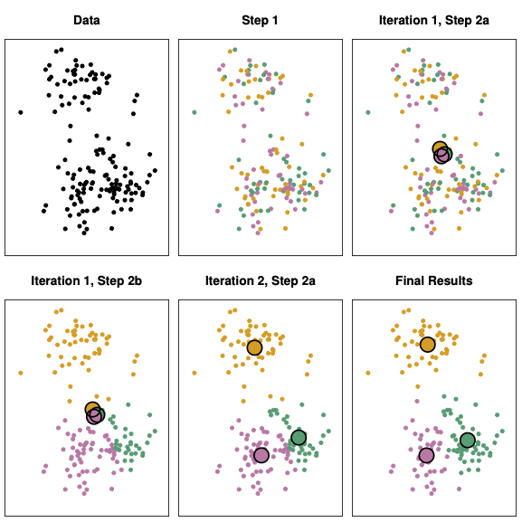

# Case: Aldipress

- Company: Aldipress
- Lead Data Scientist: Harm Bodewes
- Type of collaboration: in-company project JADS Professional Education 

## Sell less - make more money

Aldipress has been the market leader in distribution and marketing of magazines, comics, novels and puzzles in the Netherlands for over 50 years. As a partner for publishers and retailers, Aldipress' core business is to find effective solutions for assortment management, circulation management, shelf presentations and promotions. It was acquired by DPG in 2019 and currently serves:

-	120 publishers
-	1.100 magazines
-	5.200 points of sale (supermarkets, bookstores, gas stations, hospitals)

__\[start purple block\]__
  
## The challenge 

Sales of printed magazines have shrunk considerably since the advent of online media. Digitalisation creates many new opportunities for publishers, but obviously results in declining revenues from printed magazines year on year. Furthermore, shelf space in a supermarket is very expensive. These trends have challenged Aldipress and supermarket managers how to make a profit in a declining market. In essence, this boils down optimal matching of supply and demand of the many magazines across many different types of shops.

Traditionally, Aldipress' strategy was to sell as many magazines as possible, from as many publishers as possible, from as many points of sale as possible. Following a new business strategy in 2020, the approach for distribution of print magazines was changed to focus on a core assortment per store type. You can imagine this was a considerablt mind shift for a company which has been very successful with a “steady” business concept for decades.

## The solution

To support this this new strategy with data analysis, Harm Bodewes stepped in and applied unsupervised machine learning to identify different different store types in a jungle of numerical data. Specifically, he used K-Means clustering which takes several numerical attributes as input to identify a pre-defined number (K) clusters. The outcome of the various runs of the clustering algorithm were analysed qualitatively to arrive at a practical set of store type. In addition, a core assortment and a uniform shelf layout was defined for each different store type. The solution was developed in April-September 2021 and is currently being implemented at SUPERUNIE and other supermarkets in The Netherlands.

Source: [Introduction to Statistical Learning, 2nd edition](https://www.statlearning.com/). Chapter 12: Unsupervised Learning.

The figure illustrates how these clusters are determined. The algorithm runs in several iterations, and every iteration has several steps. The objective of the algorithm is to assign a colour to each observation. In this example we see three different colours, so k=3. The example above is in the 2-dimensional space, you can see an x- and a y-axis. The power of the algorithm is that you can also run it in the n-dimensional space, which is obviously more difficult to visualize. In the Aldipress case we used a 40-dimensional space. 

We implemented this algorithm in a Python notebook. The input data came from both SAS (the forecasting “engine” of Aldipress) and SAP (the ERP system which contains all master data of Aldipress). Below you find the output for SUPERUNIE stores with 3 metres shelf space.

## The benefit

Based on the output, Aldipress defined 3 store types: BUDGET, FAMILY and PREMIUM. In BUDGET stores, Aldipress will place more TV Guides (who is still buying TV magazines in 2022 by the way?) and Gossip. In PREMIUM Aldipress will supply more Glossies and Woman-magazines. The category FAMILY is “for everybody something”.

The cluster analysis contains very relevant information for Aldipress, as this solution can minimise return cost and the risk of out-of-stock by making a good estimation of number of magazines to be sold. The supermarket manager is also happy with this solution, as he/she will only sell magazines which the consumer really wants. The small publishers with very specific magazines might be less happy and will look for other ways of distribution.

