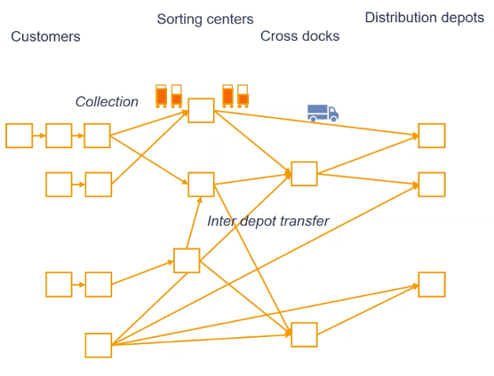
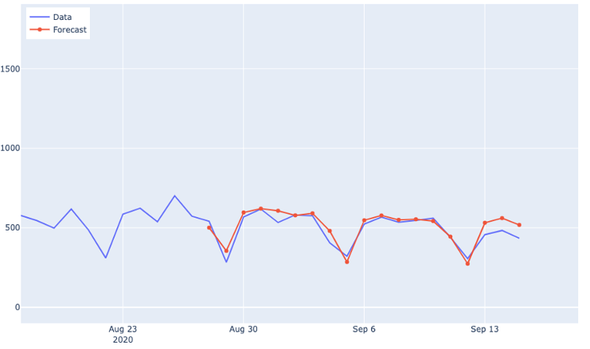
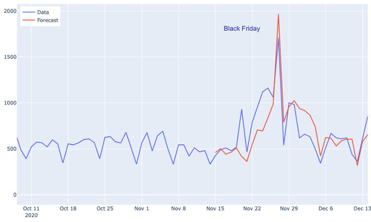

# Case title: Improving logistics at PostNL

## Case background

One of PostNL's most important services is to transport parcels ordered at webshops (PostNL customers) to consumers. This service is provided at an enormous speed and accuracy and at incredibly high volumes. As a consequence, highly efficient business processes are required to maintain this service in a cost effective way.

The PostNL process for transporting parcels from web shops to consumers is subdivided into separate processes that can be studied and optimized more or less independently: collection, first sorting (to level of rough destination area), transport (cross docking), second sorting (to consumer addresses) and distribution from second sorting center to consumer. All these processes require the planning of capacities, e.g.: numbers of parcel containers, numbers of trucks, their driving schedules, the number of sorting belts at the sorting centers, the amount of labor capacity. Obviously, capacity planning is strongly dependent on the expected number of parcel containers, parcels, their sizes and expected destinations. The better these expected numbers can be forecasted, the more efficiently capacities can be planned and therefore accurate forecasting is crucial.

## The challenge

Orders at webshops are placed until late in the evening. The capacity, sorting and route plans for the next few days have already largely been made by then. Hundreds of thousand containers are daily planned for the shipment of packaged goods. Shortages or a surplus of available containers at a pick-up location leads to inefficient logistics like delays, increasing CO2 emissions and additional costs, let alone the frustration of people.

Improving the expectation of the volume of packaged and containerised goods translates into an optimized logistical planning. Online and physical stores have different characteristics. Some have highly seasonal volumes, others are very stable. We can use such information to more accurately predict the shipment of containerised goods released for transport.

## The results

For the logistic operations of containers, a Proof of Concept (PoC) is developed to optimize in real-time available container stock at pick-up locations (stores). One of the many pieces of the puzzle for a digital twin in logistics. During this PoC phase, the prediction model is deployed manually per location. In the next phase the predictions are made by a request from a Control Tower application. A place where the expected volume of packaged and containerised goods is closely monitored and compared with the transport planning. Key for success is breaking down the bigger picture into multiple models per customer category that can be validated individually. This approach avoids major investments that later turn out to be unnecessary.

The performance of the model during day to day operations showed an accuracy of 10-30%, depending on the time of the year. Lesson learned is that sudden highly seasonal and fluctating volumes led most of the time to overforecasting and require separate modelling. However, the model was  able to correctly predict outliers such as Black Friday.

With the help of machine learning, decisions are no longer made based on assumptions but on data, which can be used to determine whether the expectation of the volume of packaged and containerised goods represents reality. As soon as a deviation occurs somewhere, the impact can be calculated to support decisions that are required to fulfill the customer promise.

## Testimonial

A solid technical foundation and the entrepreneurial mindset on delivering business value made it perfect for me. Designing a better business by breaking down the bigger picture into multiple data science challenges that can be designed and validated individually. This approach helped me to avoid major investments and risks that later turn out to be unnecessary. Executive buy-in by explainable AI.

## Facts

- Company: PostNL
- Lead Data Scientist: Peter Siepel
- Type of collaboration: in-company project JADS Professional Education 
